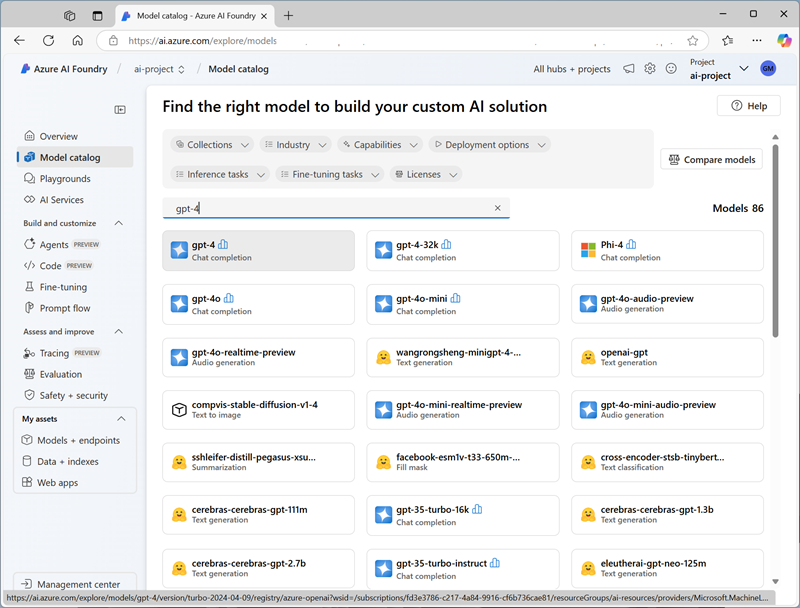
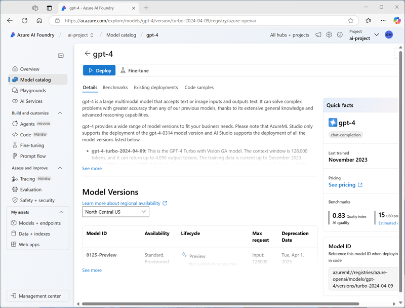
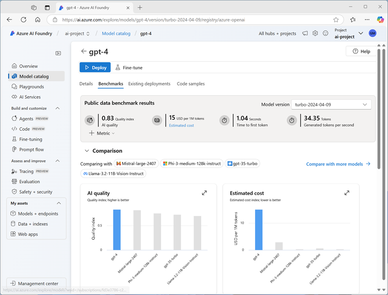
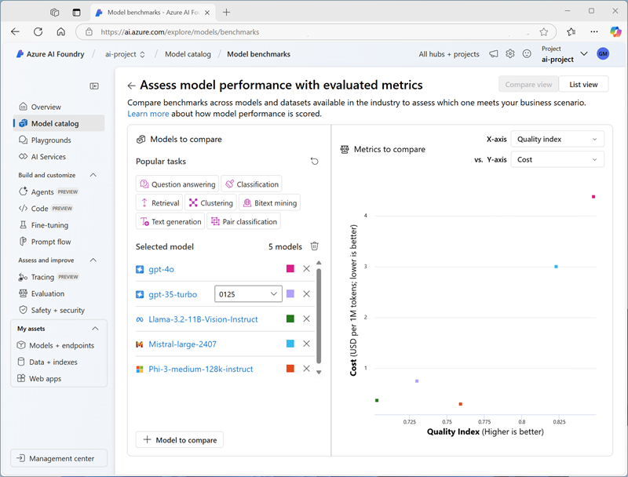
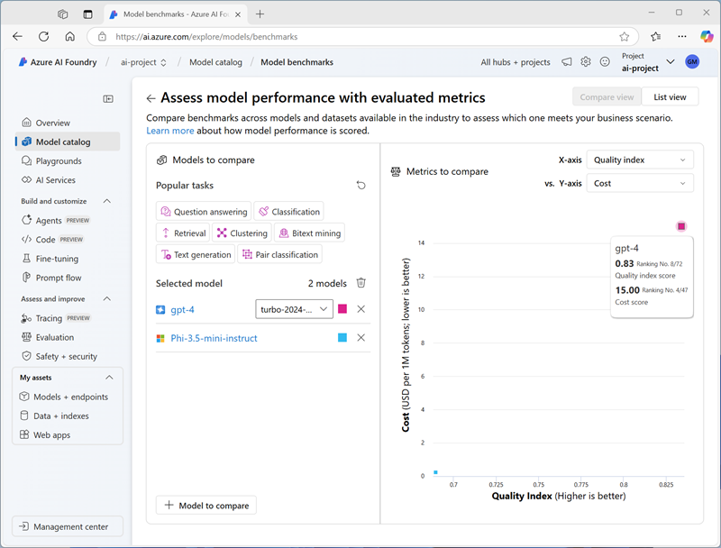

---
lab:
    title: 'Choose and deploy a language model'
    description: 'Generative AI applications are built on one or more language models. Learn how to find and select appropriate models for your generative AI project.'
---

# Choose and deploy a language model

The Azure AI Foundry model catalog serves as a central repository where you can explore and use a variety of models, facilitating the creation of your generative AI scenario.

In this exercise, you'll explore the model catalog in Azure AI Foundry portal, and compare potential models for a generative AI application that assists in solving problems.

This exercise will take approximately **25** minutes.

## Create an Azure AI hub and project

An Azure AI hub provides a collaborative workspace within which you can define one or more *projects*. Let's create a project and Azure AI hub.

1. In a web browser, open [Azure AI Foundry portal](https://ai.azure.com) at `https://ai.azure.com` and sign in using your Azure credentials.

1. In the home page, select **+ Create project**.
1. In the **Create a project** wizard, enter a suitable project name for (for example, `my-ai-project`) then review the Azure resources that will be automatically created to support your project.
1. Select **Customize** and specify the following settings for your hub:
    - **Hub name**: *A unique name - for example `my-ai-hub`*
    - **Subscription**: *Your Azure subscription*
    - **Resource group**: *Create a new resource group with a unique name (for example, `my-ai-resources`), or select an existing one*
    - **Location**: Select **Help me choose** and then select **gpt-4** in the Location helper window and use the recommended region\*
    - **Connect Azure AI Services or Azure OpenAI**: *Create a new AI Services resource with an appropriate name (for example, `my-ai-services`) or use an existing one*
    - **Connect Azure AI Search**: Skip connecting

    > \* Model quotas are constrained at the tenant level by regional quotas. In the event of a quota limit being reached later in the exercise, there's a possibility you may need to create another resource in a different region.

1. Select **Next** and review your configuration. Then select **Create** and wait for the process to complete.
1. When your project is created, close any tips that are displayed and review the project page in Azure AI Foundry portal, which should look similar to the following image:

    

## Configure Azure AI Inference service deployment

There are multiple options for deploying models in the Azure AI Foundry portal. In this exercise, you'll use the **Azure AI model inference** deployment option, which supports both *Azure OpenAI* models and *Model as a service* models from the Azure AI Foundry model catalog. Since all models are deployed to a common endpoint hosted by your Azure AI Services resource, it is easy to switch between models when testing them in order to compare behavior and performance.

1. In the toolbar at the top right of your Azure AI Foundry project page, use the **Preview features** icon to display preview features.
1. Enable the **Deploy models to Azure AI model inference service** feature. Then close the **Preview features** pane.

## Review model details and benchmarks

To help you choose a model, you can explore model descriptions and benchmarks to determine which model best fits your needs.

1. In the Azure AI Foundry project portal, in the navigation pane on the left, select **Model catalog**.
1. In the model catalog home page, search for `gpt-4` to find the **gpt-4** chat completion model.

    

1. Select the **gpt-4** model and view its details. Read the description and review the other information available on the page.

    

1. On the **gpt-4** page, view the **Benchmarks** tab to see how the model compares across some standard performance benchmarks with other models that are used in similar scenarios.

    

1. Use the back arrow (**&larr;**) next to the **gpt-4** page title to return to the model catalog home page.
1. In the model catalog, search for `Phi-3.5-mini-instruct` and view the details and benchmarks for the **Phi-3.5-mini-instruct** model.

## Compare models

You've reviewed two different models, both of which could be used to implement a generative AI chat application. Now let's compare the metrics for these two models visually.

1. Return to the **Model catalog** home page.
1. Select **Compare models**. A visual chart for model comparison is displayed with a selection of common models.

    

1. In the **Models to compare** pane on the left, note that you can select popular tasks, such as *question answering* to automatically select commonly used models for specific tasks.
1. Use the **Clear all models** (&#128465;) icon to remove all of the pre-selected models.
1. Use the **+ Model to compare** button to add the **gpt-4** model to the list. Then use the same button to add the **Phi-3.5-mini-instruct** model to the list.
1. Review the chart, which compares the models based on **Quality Index** (a standardized score indicating model quality) and **Cost**. You can see the specific values for a model by holding the mouse over the point that represents it in the chart.

    

1. In the **X-axis** dropdown menu, under **Quality**, select the following metrics and observe each resulting chart before switching to the next:
    - Accuracy
    - Coherence
    - Fluency
    - Relevance

## Deploy models

Now that you have explored your options through model benchmarks, you're ready to deploy language models. You can browse the model catalog, and deploy from there, or you can deploy a model through the **Deployments** page. Let's explore both options.

### Deploy a model from the *Model catalog*

Let's start by deploying a model from the Model catalog. You may prefer this option when you want to review multiple available models.

1. Return to the **Model catalog** home page.
1. Search for and select the `gpt-4` model, just as you did previously.
1. On the **gpt-4** page, select **Deploy** and deploy the model with the following settings by selecting **Customize** in the deployment details:
    - **Deployment name**: *A unique name for your model deployment - for example `gpt-4-model`*
    - **Deployment type**: Global Standard
    - **Model version**: *Select the default version*
    - **Connected AI resource**: *Your Azure OpenAI resource connection*
    - **Tokens per Minute Rate Limit (thousands)**: 5K
    - **Content filter**: DefaultV2
    - **Enable dynamic quota**: Disabled
      
    > **Note**: Reducing the TPM helps avoid over-using the quota available in the subscription you are using. 5,000 TPM is sufficient for the data used in this exercise.

1. Wait for the **Provisioning state** of the deployment to be **Succeeded**.

### Deploy a model through *Models + endpoints*

If you already know exactly which model you want to deploy, you may prefer to do it through **Models + endpoints**.

1. In the navigation bar on the left, in the **My assets** section, select **Models + endpoints**.
1. In the **Model deployments** tab, in the **+ Deploy model** drop-down list, select **Deploy base model**. Then search for `Phi-3.5-mini-instruct` and confirm you selection.
1. Agree to the model license.
1. Deploy a **Phi-3.5-mini-instruct** model with the following settings:
    - **Deployment name**: *A unique name for your model deployment - for example, `phi-35-model`*
    - **Deployment type**: Global Standard
    - **Deployment details**: *Use the default settings*

1. Wait for the **Provisioning state** of the deployment to be **Succeeded**.

## Test your models in the chat playground

Now that you have two models to compare, let's see how the models behave in a conversational interaction.

### Prepare to chat

1. In the navigation bar, select **Playgrounds**. Then select the **Chat playground**.
1. In the **Setup** pane, in the **Give the model instructions and context** field, set the system prompt to `You are an AI assistant that helps solve problems.`
1. Select **Apply changes**.

### Chat with the *gpt-4* model

In the **Setup** pane, select your *gpt-4* model.
1. In the chat window, enter the following query

    ```
    I have a fox, a chicken, and a bag of grain that I need to take over a river in a boat. I can only take one thing at a time. If I leave the chicken and the grain unattended, the chicken will eat the grain. If I leave the fox and the chicken unattended, the fox will eat the chicken. How can I get all three things across the river without anything being eaten?
    ```

1. View the response. Then, enter the following follow-up query:

    ```
    Explain your reasoning.
    ```

### Chat with the *Phi-3.5* model

1. In the **Setup** pane, select your *Phi-3.5* model.
1. Ensure that a new chat session is started before repeating the same prompts you previously used to test the gpt-4 model.
1. In the chat window, enter the following query

    ```
    I have a fox, a chicken, and a bag of grain that I need to take over a river in a boat. I can only take one thing at a time. If I leave the chicken and the grain unattended, the chicken will eat the grain. If I leave the fox and the chicken unattended, the fox will eat the chicken. How can I get all three things across the river without anything being eaten?
    ```

1. View the response. Then, enter the following follow-up query:

    ```
    Explain your reasoning.
    ```

### Perform a further comparison

1. Try the following puzzle with both models, asking the models to explain their reasoning (the correct answer is 40!):

    ```
    I have 53 socks in my drawer: 21 identical blue, 15 identical black and 17 identical red. The lights are out, and it is completely dark. How many socks must I take out to make 100 percent certain I have at least one pair of black socks?
    ```

## Reflect on the models

You've compared two models, which may vary in terms of both their ability to generate appropriate responses and in their cost. In any generative scenario, you need to find a model with the right balance of suitability for the task you need it to perform and the cost of using the model for the number of requests you expect it to have to handle.

The details and benchmarks provided in the model catalog, along with the ability to visually compare models provides a useful starting point when identifying candidate models for a generative AI solution. You can then test candidate models with a variety of system and user prompts in the chat playground.

## Clean up

If you've finished exploring Azure AI Foundry portal, you should delete the resources you have created in this exercise to avoid incurring unnecessary Azure costs.

1. Open the [Azure portal](https://portal.azure.com) and view the contents of the resource group where you deployed the resources used in this exercise.
1. On the toolbar, select **Delete resource group**.
1. Enter the resource group name and confirm that you want to delete it.
